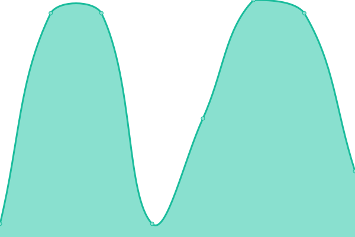
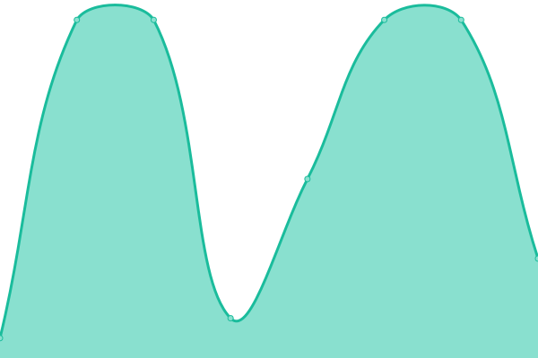

# [📈 Live Status](https://Tubnom.github.io/tubnet-uptime): <!--live status--> **🟧 Partial outage**

This repository contains the open-source uptime monitor and status page for [TubNet Community](https://Tubnom.github.io/tubnet-uptime), powered by [Upptime](https://github.com/upptime/upptime).

With [Upptime](https://upptime.js.org), you can get your own unlimited and free uptime monitor and status page, powered entirely by a GitHub repository. We use [Issues](https://github.com/Tubnom/tubnet-uptime/issues) as incident reports, [Actions](https://github.com/Tubnom/tubnet-uptime/actions) as uptime monitors, and [Pages](https://Tubnom.github.io/tubnet-uptime) for the status page.

<!--start: status pages-->
<!-- This summary is generated by Upptime (https://github.com/upptime/upptime) -->
<!-- Do not edit this manually, your changes will be overwritten -->
<!-- prettier-ignore -->
| URL | Status | History | Response Time | Uptime |
| --- | ------ | ------- | ------------- | ------ |
|  [TubNet Java (prod)](prod.tubnet.gg) | 🟩 Up | [tub-net-java-prod.yml](https://github.com/Tubnom/tubnet-uptime/commits/HEAD/history/tub-net-java-prod.yml) | 

 38ms
     
 | 

<a href="https://Tubnom.github.io/tubnet-uptime/history/tub-net-java-prod">100.00%</a>
    

|  [TubNet Java (lunar)](lunar.tubnet.gg) | 🟩 Up | [tub-net-java-lunar.yml](https://github.com/Tubnom/tubnet-uptime/commits/HEAD/history/tub-net-java-lunar.yml) | 

 117ms
     
 | 

<a href="https://Tubnom.github.io/tubnet-uptime/history/tub-net-java-lunar">100.00%</a>
    

|  [TubNet Java (thru)](thru.tubnet.gg) | 🟩 Up | [tub-net-java-thru.yml](https://github.com/Tubnom/tubnet-uptime/commits/HEAD/history/tub-net-java-thru.yml) | 

 89ms
     
 | 

<a href="https://Tubnom.github.io/tubnet-uptime/history/tub-net-java-thru">100.00%</a>
    

|  [TubNet Java (mc)](mc.tubnet.gg) | 🟩 Up | [tub-net-java-mc.yml](https://github.com/Tubnom/tubnet-uptime/commits/HEAD/history/tub-net-java-mc.yml) | 

 88ms
     
 | 

<a href="https://Tubnom.github.io/tubnet-uptime/history/tub-net-java-mc">100.00%</a>
    

|  [TubNet Events](5.161.155.38) | 🟥 Down | [tub-net-events.yml](https://github.com/Tubnom/tubnet-uptime/commits/HEAD/history/tub-net-events.yml) | 

 0ms
     
 | 

<a href="https://Tubnom.github.io/tubnet-uptime/history/tub-net-events">0.00%</a>
    

|  [TubNet Forums](https://forums.tubnet.gg/) | 🟩 Up | [tub-net-forums.yml](https://github.com/Tubnom/tubnet-uptime/commits/HEAD/history/tub-net-forums.yml) | 

 67ms
     
 | 

<a href="https://Tubnom.github.io/tubnet-uptime/history/tub-net-forums">100.00%</a>
    

|  [CDN (S3 Bucket)](https://cdn.tubnet.gg/minecraft-resourcepack/TubPack-production.zip) | 🟩 Up | [cdn-s3-bucket.yml](https://github.com/Tubnom/tubnet-uptime/commits/HEAD/history/cdn-s3-bucket.yml) | 

 214ms
     
 | 

<a href="https://Tubnom.github.io/tubnet-uptime/history/cdn-s3-bucket">100.00%</a>
    

|  [TubNet Rewards (Frontend)](https://rewards.tubnet.gg) | 🟩 Up | [tub-net-rewards-frontend.yml](https://github.com/Tubnom/tubnet-uptime/commits/HEAD/history/tub-net-rewards-frontend.yml) | 

 162ms
     
 | 

<a href="https://Tubnom.github.io/tubnet-uptime/history/tub-net-rewards-frontend">100.00%</a>
    

|  [TubNet Rewards (Backend)](https://reward.prd.svc.tubnet.io/) | 🟩 Up | [tub-net-rewards-backend.yml](https://github.com/Tubnom/tubnet-uptime/commits/HEAD/history/tub-net-rewards-backend.yml) | 

 264ms
     
 | 

<a href="https://Tubnom.github.io/tubnet-uptime/history/tub-net-rewards-backend">100.00%</a>
    

|  [TubNet Proxmox (EB)](https://eb.clmgr.tubnet.io) | 🟩 Up | [tub-net-proxmox-eb.yml](https://github.com/Tubnom/tubnet-uptime/commits/HEAD/history/tub-net-proxmox-eb.yml) | 

 624ms
     
 | 

<a href="https://Tubnom.github.io/tubnet-uptime/history/tub-net-proxmox-eb">100.00%</a>
    

|  [TubNet Proxmox (FS)](https://fs.clmgr.tubnet.io) | 🟩 Up | [tub-net-proxmox-fs.yml](https://github.com/Tubnom/tubnet-uptime/commits/HEAD/history/tub-net-proxmox-fs.yml) | 

 338ms
     
 | 

<a href="https://Tubnom.github.io/tubnet-uptime/history/tub-net-proxmox-fs">100.00%</a>
    

|  [Creg (?)](https://creg.tubnet.io) | 🟩 Up | [creg.yml](https://github.com/Tubnom/tubnet-uptime/commits/HEAD/history/creg.yml) | 

 274ms
     
 | 

<a href="https://Tubnom.github.io/tubnet-uptime/history/creg">100.00%</a>
    

<!--end: status pages-->

[**Visit our status website →**](https://Tubnom.github.io/tubnet-uptime)

## 📄 License

- Powered by: [Upptime](https://github.com/upptime/upptime)
- Code: [MIT](./LICENSE) © [TubNet Community](https://Tubnom.github.io/tubnet-uptime)
- Data in the `./history` directory: [Open Database License](https://opendatacommons.org/licenses/odbl/1-0/)
